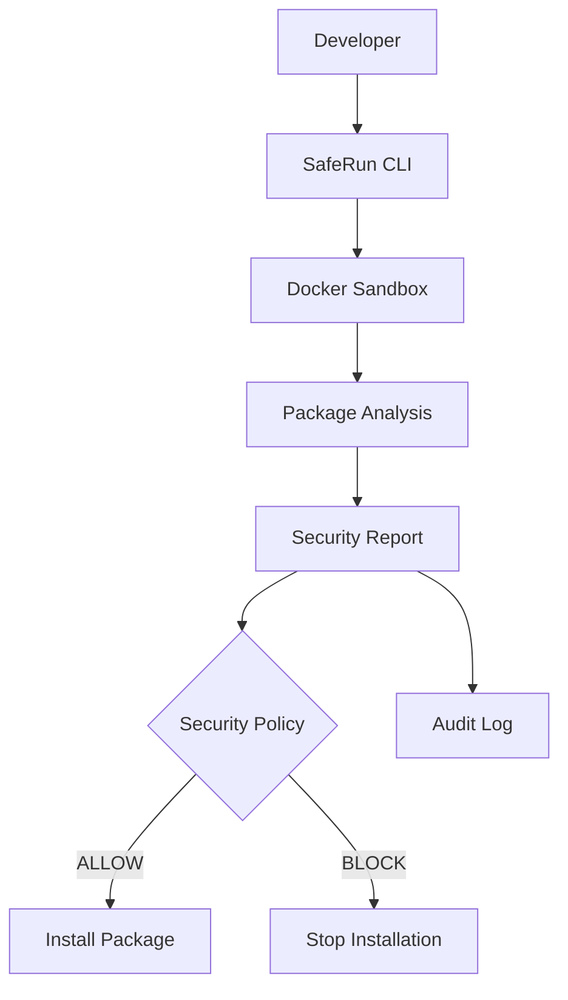

# SafeRun

SafeRun is a secure package installation sandbox for developers who want to inspect npm packages before they run in a project. It addresses software supply chain attacks by analyzing package metadata, lifecycle scripts, files, processes, and network activity inside an isolated Docker environment before installation is approved.

Instead of trusting a package immediately:

```bash
npm install lodash
```

run the installation through SafeRun:

```bash
saferun npm install lodash
```

SafeRun analyzes the package in a disposable sandbox, produces a security report and risk score, applies a security policy, and records the result in a local audit log. Low-risk packages can be approved for installation; packages that violate the policy are blocked.

## How It Works



SafeRun currently supports npm package installation and uses Docker to provide isolation. The analysis includes package metadata, lifecycle scripts, suspicious files, process activity, and network activity observed during the sandboxed operation.

## Installation

SafeRun requires Docker. Install Docker separately before running `saferun setup`.

### Linux and macOS

```bash
curl -fsSL https://www.saferun.tech/install.sh | sh
```

### Windows PowerShell

```powershell
irm https://www.saferun.tech/install.ps1 | iex
```

The installers download the selected GitHub Release binary, verify its SHA-256 checksum, and install it without requiring Go or a repository checkout. Set `SAFERUN_VERSION` to install a specific release. The Windows installer supports `amd64` and `arm64` and adds its per-user installation directory to `PATH`.

## Quick Start

```bash
saferun setup
saferun npm install lodash
saferun audit
saferun audit --clear
```

`saferun setup` checks Docker, verifies the sandbox image, and downloads it when necessary. The npm command analyzes the requested package before asking for approval to install it in the current project.

## CLI Output

A package analysis includes a security report, risk score, and policy decision:

```text
SafeRun Security Report
-----------------------
Package: lodash@4.17.21

Risk Summary
------------
Risk: LOW
Score: 0
Findings: 0

Security Policy
---------------
Decision: ALLOW
Install lodash@4.17.21 in your project? [y/N]
```

Higher-risk results include the relevant findings and can end with a `BLOCK` decision. Medium-risk results may require explicit confirmation. Every analysis outcome is recorded locally and can be reviewed with:

```bash
saferun audit
```

Example audit output:

```text
SafeRun Audit Log
-----------------
TIMESTAMP           | DECISION     | PACKAGE                         | RISK    | INSTALL      | VERIFY       | ROLLBACK           | APPROVAL
2026-09-05 12:30    | ALLOW        | lodash                          | LOW     | SUCCESS      | PASSED       | -                 | ACCEPTED
  score: 0 | findings: 0
```

Use `saferun audit --all` to display the complete history or `saferun audit --clear` to remove it. The default audit file is stored at `~/.saferun/audit.jsonl`.

## Supported Platforms

- Linux
- macOS
- Windows

SafeRun uses Docker for sandboxing, so Docker must be installed and running on the selected platform.

## Project Structure

```text
saferun/
├── cmd/
│   └── saferun/
│       └── main.go
├── internal/
│   ├── analyzer/
│   ├── audit/
│   ├── cli/
│   ├── monitor/
│   ├── package_manager/
│   ├── report/
│   ├── risk/
│   └── sandbox/
├── pkg/
├── sandbox/
│   └── images/
│       └── node/
│           └── Dockerfile
├── tests/
├── docs/
├── go.mod
└── README.md
```

## Development

### Requirements

- Linux, macOS, or Windows with WSL
- Go 1.25 or later
- Docker
- Node.js and npm
- Git

### Run from source

```bash
go run ./cmd/saferun setup
go run ./cmd/saferun npm install express
```

Build the CLI with:

```bash
go build -o saferun ./cmd/saferun
```

Use the built-in help and version commands:

```bash
saferun --help
saferun --version
```

### Manual GitHub Release Installation

Download the binary for your platform and `SHA256SUMS` from the [SafeRun v1.0.5 release](https://github.com/dag12y/saferun/releases/tag/v1.0.5). Verify the binary against `SHA256SUMS`, then install it as `~/.local/bin/saferun`:

```bash
mkdir -p ~/.local/bin
install -m 0755 saferun-linux-amd64 ~/.local/bin/saferun
```

The Linux and macOS installer installs to `~/.local/bin/saferun` by default. If that directory is not in `PATH`, the installer prints the command needed to add it. The installer does not install Docker.

### Windows Installation Details

The PowerShell installer installs `saferun.exe` to `%LOCALAPPDATA%\SafeRun\bin` by default and adds that directory to the user `PATH` without requiring Administrator privileges. Open a new PowerShell session after installation so the updated `PATH` is loaded.

To update, run the installer again. To remove SafeRun, delete `%LOCALAPPDATA%\SafeRun\bin\saferun.exe` and remove that directory from the user `PATH`.

Configuration variables:

- `SAFERUN_VERSION`: release tag, such as `v1.0.5`
- `SAFERUN_RELEASE_BASE_URL`: HTTPS release base URL; defaults to `https://github.com/dag12y/saferun/releases/download`
- `SAFERUN_INSTALL_DIR`: per-user installation directory; defaults to `%LOCALAPPDATA%\SafeRun\bin`

For example, to install a specific Windows release:

```powershell
$env:SAFERUN_VERSION = 'v1.0.5'
$env:SAFERUN_INSTALL_DIR = "$env:LOCALAPPDATA\SafeRun\bin"
irm https://www.saferun.tech/install.ps1 | iex
```

If the command is not found after installation, open a new terminal so the updated `PATH` is loaded. Confirm Docker is installed and running with `saferun setup`; the SafeRun installers do not install Docker.

## Roadmap

### Completed

- ✓ npm package sandboxing
- ✓ Docker isolation
- ✓ Security reports
- ✓ Cross-platform installers
- ✓ Audit management

### Future

- More package managers
- GitHub Action integration
- AI-powered security explanations

See [ROADMAP.md](ROADMAP.md) for the public roadmap.

## Releases

SafeRun provides prebuilt release binaries for Linux, macOS, and Windows. The release process publishes cross-platform binaries and SHA-256 checksums for each tagged version.

## License

SafeRun is licensed under the Apache License 2.0. See [LICENSE](LICENSE) for the full license text.
